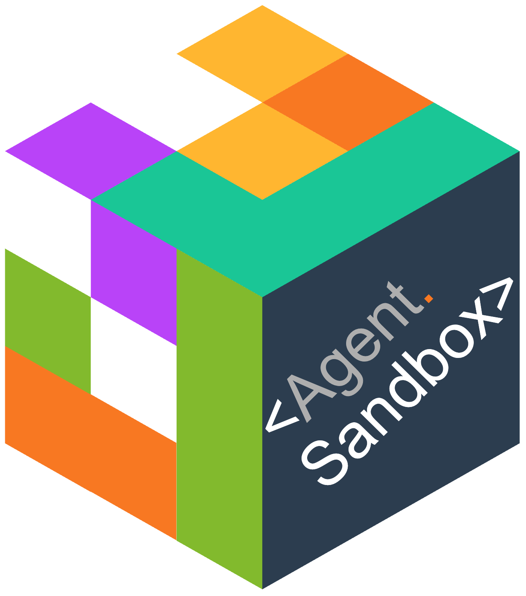
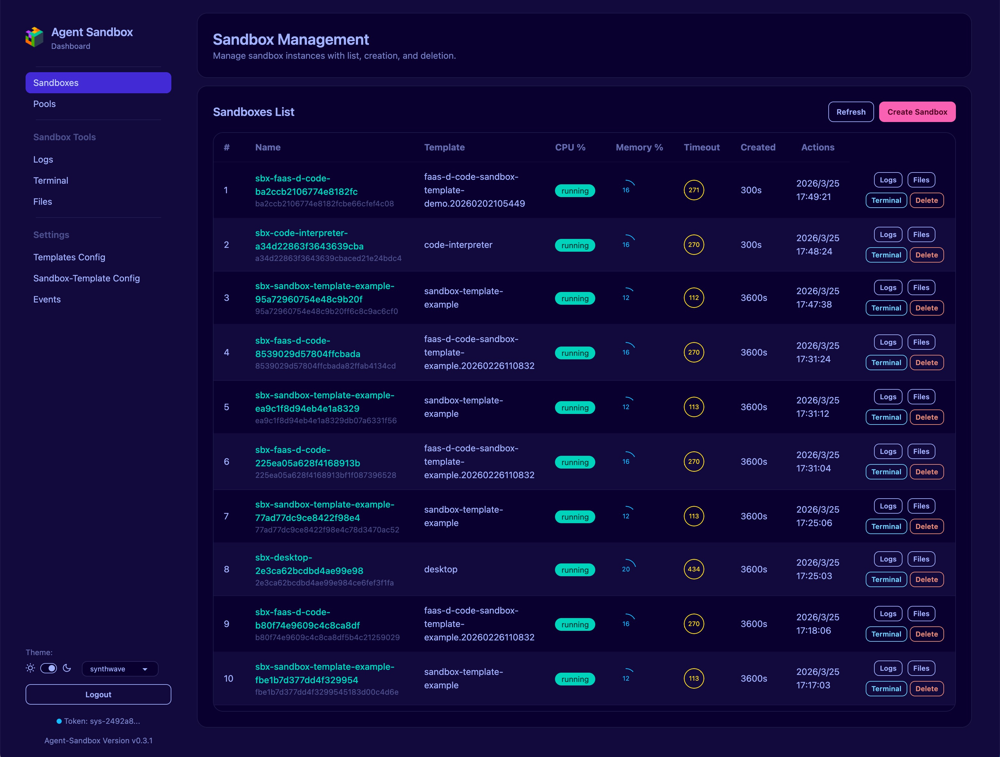
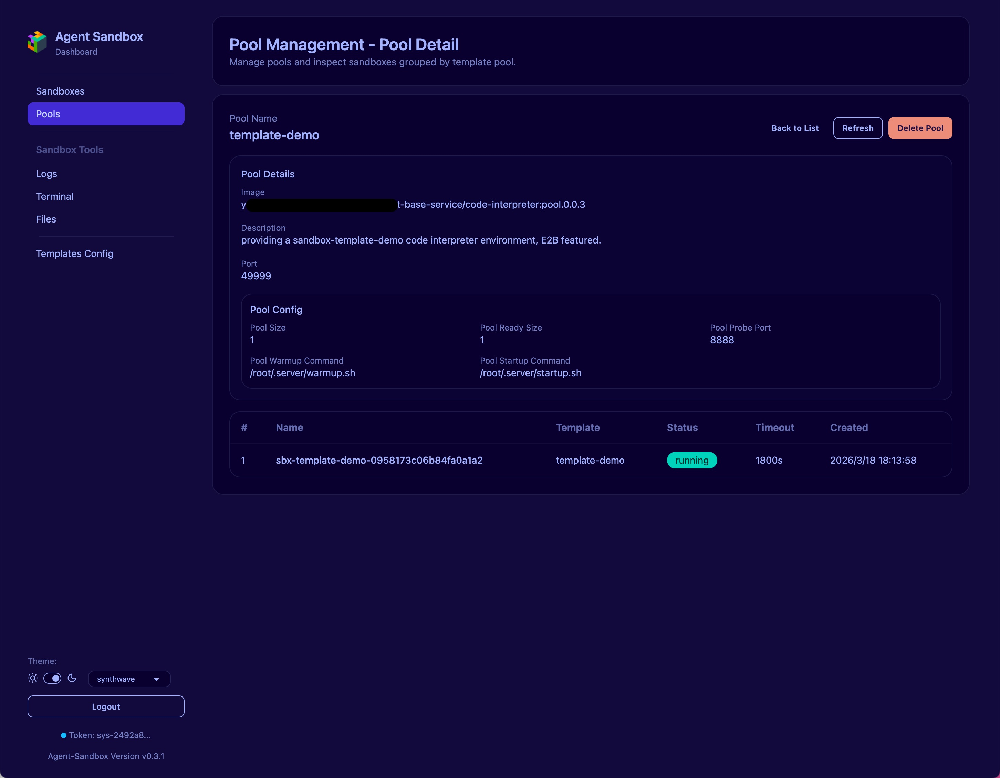
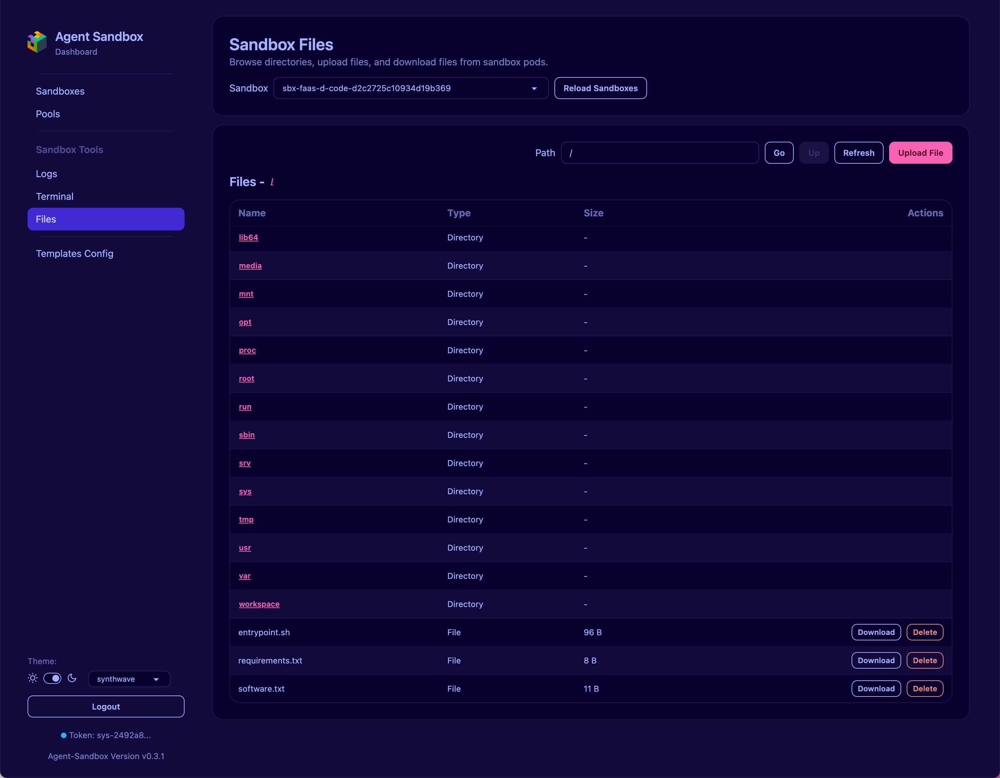
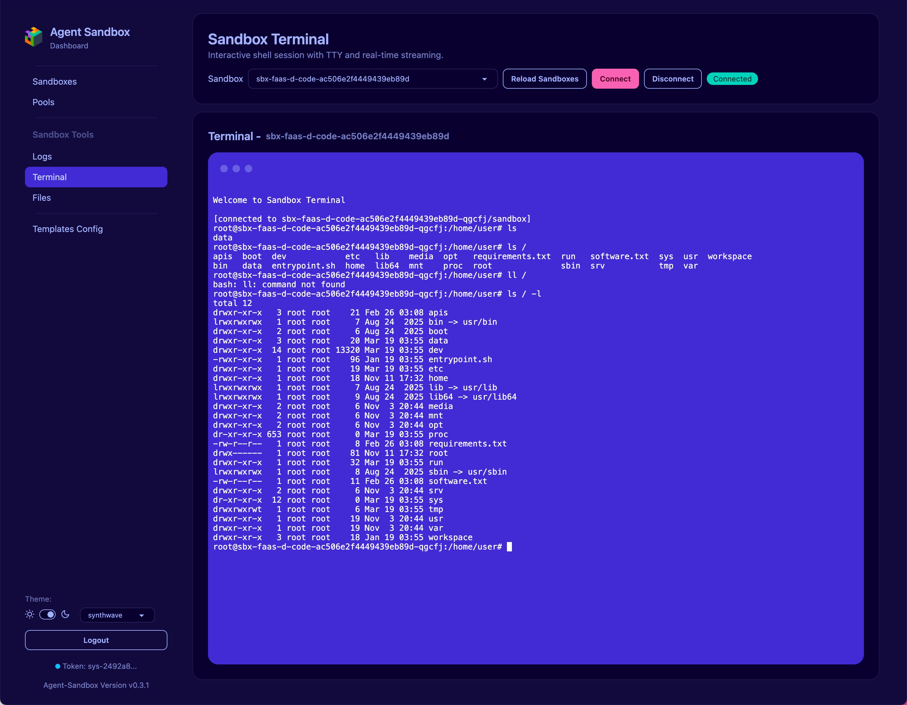
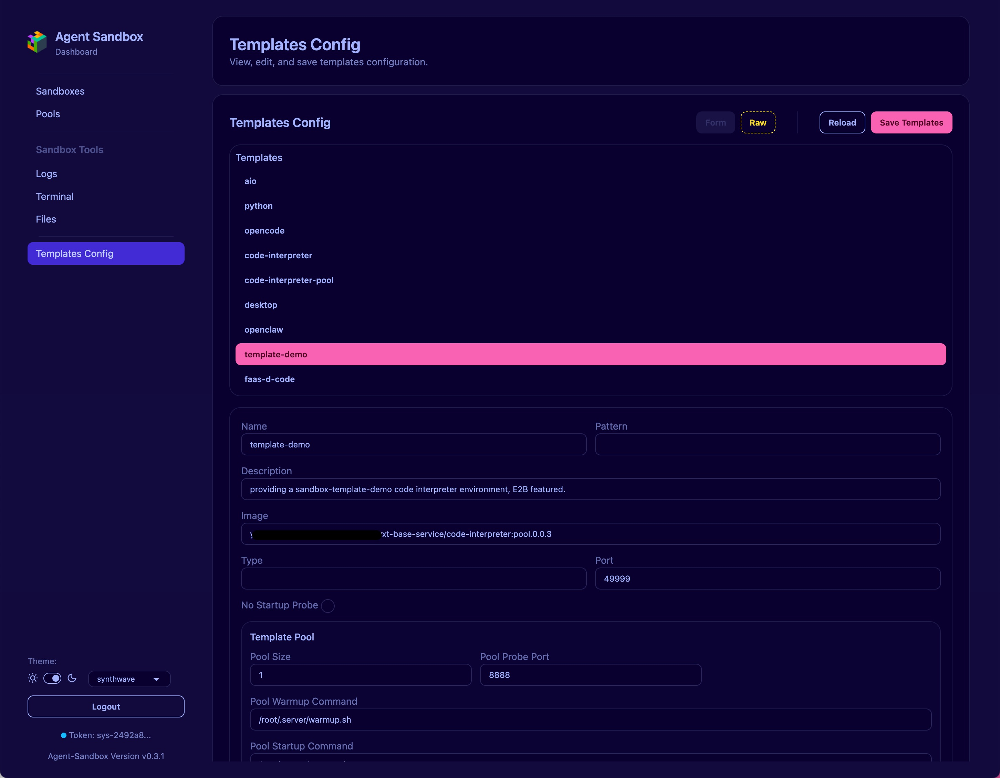
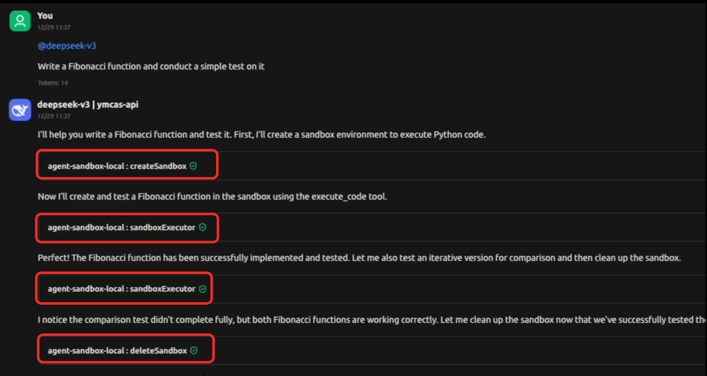
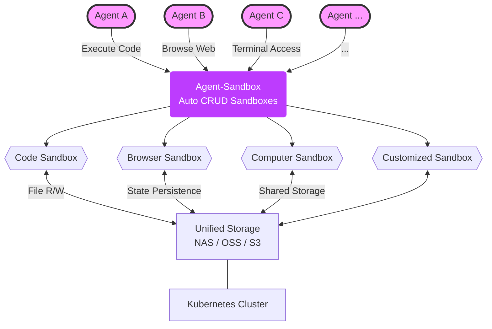
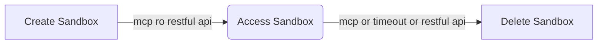

<div align="center">
  <picture >
  
  </picture>

  <p align="center"><b> Agent-Sandbox is an open-sourced <a href="https://docs.blaxel.ai/Sandboxes/Overview">Blaxel Sandbox</a> or <a href="https://e2b.dev/">E2B</a> like solution! </b>

<b>🎉🎉🎉 Complete compatible with <a href="https://e2b.dev/">E2B</a> protocol and SDKs.✅</b>
</p>
<br/>
  <p align="center">Agent-Sandbox is an enterprise-grade ai-first, cloud-native, high-performance runtime environment designed for AI Agents. It combines the Kubernetes
with container isolation. Allows Agents to securely run untrusted LLM-generated Code, Browser use, Computer use, and
Shell commands etc. with stateful, long-running, multi-session and multi-tenant.</p>
</div>

<div align="center">
<h3>Agent-Sandbox UI</h3> 
<div>including Sandbox Management, Pool Management, Template Management and Files, Logs, Terminal, Traffic Monitor access Tools for Sandbox etc. <br><br/> UI path is <a href="https://agent-sandbox.domain.com/ui">https://agent-sandbox.domain.com/ui</a>.   
<br/>
  Default UI admin login token:  <b>sys-2492a85b10ed4cb083b2c76b181eac96</b>,  config user tokens by env variable <b>API_TOKENS_RAW</b> e.g. user1-2492a85b10ed4cb083b2c76b181eac00,user2-2492a85b10ed4cb083b2c76b181eac01 . 
</div>
  <br/><br/>
<div>
<a href="docs/imgs/uiimg-sbs.png" target="_blank">
    
</a>
</div>
<div>
<a href="docs/imgs/uiimg-pools.jpg" target="_blank">
    
</a>
<a href="docs/imgs/uiimg-files.jpg" target="_blank">
    
</a>
<a href="docs/imgs/uiimg-terminal.png" target="_blank">
    
</a>
<a href="docs/imgs/uiimg-tpl.jpg" target="_blank">
    
</a>
</div>
</div>

<hr/>

<div align="center">
<video src="https://github.com/user-attachments/assets/819c8534-a759-4ad0-9be5-7f95e6757168" autoplay loop muted playsinline >
    Your browser does not support the video tag.
</video>
<br/>
<h3>Agent Use Sandbox Demo</h3>
<br/>
<picture >
  
</picture>
</div>

---

# Why Agent-Sandbox?

When we are developing AI Agents, one of the critical challenges is providing an Enterprise-Grade&Production-Grade environment for executing untrusted code and performing various tasks, that is **Multi-Session and Multi-Tenant**.

Sandbox must be isolated on a **Per-Agent** even **Per-User** basis to ensure security and prevent interference **between different conversation or task**. Additionally, the sandbox environment should support state persistence, allowing agents to maintain context and data across multiple interactions or multi agents etc.

Therefore, **Multi-Session and Multi-Tenant** is very critical,  Each sandbox is isolated on a per-agent or per-user basis, ensuring security and preventing interference between different conversations or tasks.

I found [kubernetes-sigs/agent-sandbox](https://github.com/kubernetes-sigs/agent-sandbox) leverages [AIO Sandbox](https://github.com/agent-infra/sandbox) and Kubernetes to provide a similar solution. But it seems not friendly for AI Agents to manage the sandbox lifecycle and not friendly for commonly users to use it, because it faces to Kubernetes directly.

So, We decide created this **Agent-Sandbox** project, which provides a RESTful API and MCP(Model Context Protocol) server to manage the sandbox lifecycle easily. It abstracts the complexity of Kubernetes and provides a simple interface for AI Agents and users to create, access, and delete sandboxes as needed. And we refer to some design ideas from [Blaxel Sandbox](https://docs.blaxel.ai/Sandboxes/Overview) and [E2B](https://e2b.dev/) provide similar features like lifecycle management and API design. Making it more suitable for AI Agents to use, but is opensource and self-hosted.

## Full sandbox lifecycle manage by Agent-Sandbox MCP Server


## Architecture


# Features
- **🎉 E2B Fully-Compatible** - Fully compatible with [E2B](https://e2b.dev/) protocol and SDKs, allowing seamless integration with existing E2B-based AI Agents and tools, please refer to usage in `examples/` directory.
- **Ai-First** - Agents automatically manage whole Sandbox's lifecycle by the MCP( Model Context Protocol ) , making it easy to manage various Sandbox environments and access them automatically.
- **AI-Agent Runtimes** - Supports various AI agent runtimes, including code execution, browser automation, computer use, and shell command execution and easy to customize more runtimes.
- **Enterprise-Grade** - Support multiple Sandbox lifecycle manage for each tenant or session, allowing Agents to run different tasks simultaneously without interference for different tenant or session.
- **Cloud-Native** - Leverages Kubernetes built to run in cloud environments, leveraging the benefits of cloud infrastructure such as scalability, flexibility, resilience and efficient resource management.
- **Fast and Lightweight** - Designed to be lightweight and fast, minimizing Kubernetes's objects to deploy. easy to use and maintain.
- **Traffic Monitor** - Live HTTP/HTTPS traffic inspection per sandbox via a mitmproxy sidecar, streamed in real-time to the UI.

# Quick Start

## 1, Installation
You can install Agent-Sandbox by applying the provided [install.yaml](https://github.com/agent-sandbox/agent-sandbox/blob/main/install.yaml) file to your Kubernetes cluster.

requires **Kubernetes version 1.26** or higher.
```bash
kubectl create namespace agent-sandbox
kubectl apply -nagent-sandbox -f install.yaml
```
You can create an ingress or port-forward to access the Agent-Sandbox API server. Ingress like this:
```yaml
apiVersion: networking.k8s.io/v1
kind: Ingress
metadata:
  name: agent-sandbox
  namespace: agent-sandbox
spec:
  ingressClassName: ingress-nginx
  rules:
  - host: agent-sandbox.your-host.com
    http:
      paths:
      - backend:
          service:
            name: agent-sandbox
            port:
              number: 80
        path: /
```
Now you can access the Agent-Sandbox API server at `http://agent-sandbox.your-host.com`.

## 2, Usage
The Agent-Sandbox provides a RESTful API or MCP to manage sandboxes. The typical workflow involves creating a sandbox, accessing it, and then deleting it when no longer needed.



### 2.1, Use Agent-Sandbox MCP Server
You can manage sandboxes using the Model Context Protocol (MCP) with your AI Agents. The MCP server allows Agents to create, access, and delete sandboxes automatically.

MCP Server Address: `http://agent-sandbox.your-host.com/mcp`. Now support SSE(Streamable-http).

#### MCP Demos:

##### 1, Code Execution

Agents automatically create a sandbox when code needs to be executed and delete it when execution completes, ensuring isolated and secure code runs.

[code execution](https://github.com/user-attachments/assets/d6ee410f-e12c-4c40-9dcc-f16b3b1abade)


##### 2, Browser Use

Agents automatically create a sandbox when website access is needed and delete it when the task is finished, providing isolated browser sessions for web interactions.

[browser use](https://github.com/user-attachments/assets/e75daeb0-2bce-4144-9c2e-9c7979c21a05)


This MCP integration enables agents to manage sandbox resources without manual intervention, supporting multi-session and multi-tenant operations with automatic cleanup.

---

### 2.2, Use RESTful API
You can also manage sandboxes manually using the RESTful API provided by Agent-Sandbox.

#### I, Create a Sandbox
You can create a new sandbox by sending a POST request to the `/api/v1/sandbox` endpoint with the desired configuration. For example, to create an `aio` sandbox and name it `sandbox-01`, you can use the following curl command or programmatically call the API:

<table>
<tr>
<td valign="top">

**Shell**
```shell
curl --location '/api/v1/sandbox' \
--header 'Content-Type: application/json' \
--data '{"name":"sandbox-01"}'
```
for China user, please specify the local aio image registry to improve the pull speed:
```shell
curl --location '/api/v1/sandbox' \
--header 'Content-Type: application/json' \
--data '{"name":"sandbox-01","image":"enterprise-public-cn-beijing.cr.volces.com/vefaas-public/all-in-one-sandbox:latest"}'
```

</td>
<td>

**Python**
```python
import requests
import json

url = "/api/v1/sandbox"

payload = json.dumps({
  "name": "sandbox-01"
})
headers = {
  'Content-Type': 'application/json'
}

response = requests.request("POST", url, headers=headers, data=payload)

print(response.text)
```
</td>
</tr>
</table>

**Result**
```json
{
    "code": "0",
    "data": "Sandbox sandbox-01 created successfully"
}
```

#### II, Access to Sandbox
`/sandbox/{sandbox_name}` endpoint to get the access of the sandbox, including the connection details such as URL, WebSocket URL, VNC URL, or other relevant information based on the sandbox template.

Now you can access to the previously created **sandbox-01** sandbox using `/sandbox/sandbox-01`.

**You will see:**


**Use agent sandbox SDK access this sandbox:**
```python
from agent_sandbox import Sandbox

# Initialize client
client = Sandbox(base_url="http://agent-sandbox.your-host.com/sandbox/sandbox-01")
home_dir = client.sandbox.get_context().home_dir

# Execute shell commands
result = client.shell.exec_command(command="ls -la")
print(result.data.output)

# File operations
content = client.file.read_file(file=f"{home_dir}/.bashrc")
print(content.data.content)

# Browser automation
screenshot = client.browser.screenshot()
```

And this created Sandbox's MCP Server address is: `/sandbox/sandbox-01/mcp`. you can use this MCP Server with your AI Agent to access this sandbox.

For more usage, please refer to: https://github.com/agent-infra/sandbox

#### III, Delete a Sandbox
You can delete a sandbox by sending a DELETE request to the `/api/v1/sandbox/{sandbox_name}` endpoint. For example, to delete the `sandbox-01` sandbox, you can use the following curl command or programmatically call the API:


<table>
<tr>
<td valign="top">

**Shell**
```shell
curl --location --request DELETE '/api/v1/sandbox/sandbox-01'
```

</td>
<td>

**Python**
```python
import requests

url = "/api/v1/sandbox/sandbox-01"

headers = {
  'Content-Type': 'application/json'
}

response = requests.request("DELETE", url, headers=headers)

print(response.text)
```
</td>
</tr>
</table>

**Result:**

```json
{
    "code": "0",
    "data": "Sandbox sandbox-01 deleted successfully"
}
```


# Traffic Monitor

Agent-Sandbox includes a live HTTP/HTTPS traffic inspector that shows every request a sandbox makes, in real time.

## How it works

When a sandbox is started with `metadata.mitm=true`, two extra containers are injected into its pod:

1. **`mitm-init`** (init container) — sets `iptables` rules that redirect outbound port 80/443 traffic to the mitmproxy sidecar.
2. **`mitmproxy`** sidecar — runs `mitmdump` in transparent mode on port 8877, emitting JSON lines to stdout via a Python addon.

The backend streams those JSON lines from the pod logs over a WebSocket (`GET /api/v1/traffic/sandbox/{name}/ws`). The UI Traffic page connects to that socket and renders a live table of flows.

## One-time cluster setup

Apply the addon ConfigMap once per cluster (same namespace as your sandboxes):

```bash
kubectl apply -n agent-sandbox -f - <<'EOF'
apiVersion: v1
kind: ConfigMap
metadata:
  name: agent-sandbox-mitm-addon
  namespace: agent-sandbox
data:
  logger.py: |
    import json, time
    from mitmproxy import http

    class TrafficLogger:
        def response(self, flow: http.HTTPFlow) -> None:
            entry = {
                "type": "flow",
                "timestamp": flow.request.timestamp_start,
                "method":    flow.request.method,
                "url":       flow.request.pretty_url,
                "host":      flow.request.pretty_host,
                "path":      flow.request.path,
                "status":    flow.response.status_code,
                "req_size":  len(flow.request.content or b""),
                "res_size":  len(flow.response.content or b""),
                "content_type": flow.response.headers.get("content-type", ""),
                "duration_ms": round(
                    (flow.response.timestamp_end - flow.request.timestamp_start) * 1000
                ),
            }
            print(json.dumps(entry), flush=True)

        def error(self, flow: http.HTTPFlow) -> None:
            entry = {
                "type":      "error",
                "timestamp": time.time(),
                "url":       flow.request.pretty_url if flow.request else "",
                "message":   str(flow.error),
            }
            print(json.dumps(entry), flush=True)

    addons = [TrafficLogger()]
EOF
```

## Enable traffic monitoring for a sandbox

Pass `mitm=true` in the sandbox metadata at creation time:

```shell
curl -X POST /api/v1/sandbox \
  -H 'Content-Type: application/json' \
  -d '{"name":"my-sandbox","metadata":{"mitm":"true"}}'
```

Then open **Traffic** in the sidebar of the UI and select the sandbox. All outbound HTTP/HTTPS requests will appear as a live, color-coded table (green = 2xx, yellow = 3xx, orange = 4xx, red = 5xx).

## HTTPS decryption

mitmproxy acts as a transparent TLS terminator. Without extra configuration, HTTPS flows appear in the traffic table as `CONNECT` tunnel entries — you can see the destination host and timing, but not the request path, headers, or body. To see the full decrypted content, pick one of the two approaches below. They can be used together.

### Approach 1 — Install the mitmproxy CA into the container image

mitmproxy generates a self-signed CA certificate on first start and writes it to `/home/mitmproxy/.mitmproxy/mitmproxy-ca-cert.pem` inside the sidecar container. Once the sandbox container trusts that CA, mitmproxy can terminate TLS and show decrypted flows.

**Option A: extract the cert at sandbox start via `startupCmd`**

Use the sandbox template's `startupCmd` to copy the cert from the sidecar's shared process namespace and register it before your workload starts. This works for any Debian/Ubuntu-based image:

```json
{
  "name": "my-sandbox",
  "metadata": { "mitm": "true" },
  "startupCmd": "until [ -f /proc/$(pgrep mitmdump)/root/home/mitmproxy/.mitmproxy/mitmproxy-ca-cert.pem ]; do sleep 0.2; done; cp /proc/$(pgrep mitmdump)/root/home/mitmproxy/.mitmproxy/mitmproxy-ca-cert.pem /usr/local/share/ca-certificates/mitmproxy.crt && update-ca-certificates"
}
```

For Alpine-based images replace the last part with:
```sh
cp ... /usr/local/share/ca-certificates/mitmproxy.crt && update-ca-certificates
# Alpine:
cp ... /usr/local/share/ca-certificates/mitmproxy.crt && update-ca-certificates
# or:
cat ... >> /etc/ssl/certs/ca-certificates.crt
```

**Option B: bake the cert into a custom image**

If you control the image build, extract the CA cert from a running mitmproxy container once and `COPY` it in:

```bash
# 1. Extract the cert from a throwaway mitmproxy container
docker run --rm -d --name tmp-mitm mitmproxy/mitmproxy:10 mitmdump
sleep 2
docker cp tmp-mitm:/home/mitmproxy/.mitmproxy/mitmproxy-ca-cert.pem ./mitmproxy-ca-cert.pem
docker rm -f tmp-mitm
```

```dockerfile
# 2. Add it to your Dockerfile (Debian/Ubuntu example)
COPY mitmproxy-ca-cert.pem /usr/local/share/ca-certificates/mitmproxy.crt
RUN update-ca-certificates
```

> **Note:** mitmproxy regenerates its CA on each fresh start unless the `.mitmproxy` directory is persisted. For a stable cert across pod restarts, mount a PersistentVolume or a Secret at `/home/mitmproxy/.mitmproxy` containing a pre-generated `mitmproxy-ca.pem` and `mitmproxy-ca-cert.pem`.

---

### Approach 2 — `SSLKEYLOGFILE` (no CA trust required)

Processes that use OpenSSL, BoringSSL, or NSS (Python, Node.js, curl, Chrome, Firefox, etc.) can write their TLS session keys to a file when the `SSLKEYLOGFILE` environment variable is set. mitmproxy picks up this file and uses the keys to decrypt traffic without needing to be a trusted CA.

Pass the variable when creating the sandbox:

```shell
curl -X POST /api/v1/sandbox \
  -H 'Content-Type: application/json' \
  -d '{
    "name": "my-sandbox",
    "metadata": { "mitm": "true" },
    "envVars": { "SSLKEYLOGFILE": "/tmp/ssl.log" }
  }'
```

mitmproxy automatically detects and reads `/tmp/ssl.log` from the sandbox container's filesystem (both containers share a pod network and, if needed, an `emptyDir` volume can be added for the log path).

**When to use each approach**

| | CA install | `SSLKEYLOGFILE` |
|---|---|---|
| Works with custom images you own | ✅ | ✅ |
| Works with unmodified third-party images | ✅ (via `startupCmd`) | ✅ |
| Decrypts traffic from Go / Rust (which don't use OpenSSL) | ✅ | ❌ |
| Requires image rebuild | Only for Option B | ❌ |
| Shows full request/response body | ✅ | ✅ |

Either way, `CONNECT` tunnel entries are still visible even without decryption — they show the destination host, port, and connection timing, which is often enough to understand what a sandbox is talking to.

## WebSocket API

```
GET /api/v1/traffic/sandbox/{name}/ws?api_key=<token>
```

Each frame is a JSON object matching the `TrafficFlow` type:

```json
{
  "type": "flow",
  "timestamp": 1712000000.123,
  "method": "GET",
  "url": "https://api.example.com/data",
  "status": 200,
  "req_size": 0,
  "res_size": 1234,
  "content_type": "application/json",
  "duration_ms": 84
}
```

Returns `400` if the sandbox was not started with `mitm=true`.

---

# License

[Apache License](./LICENSE)
