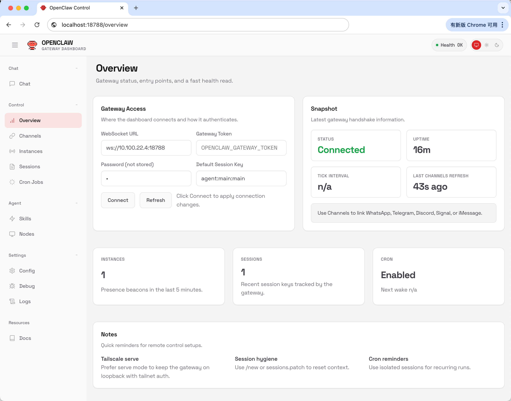
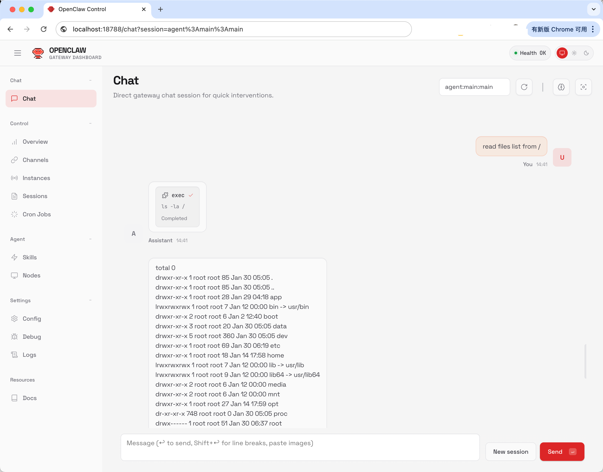
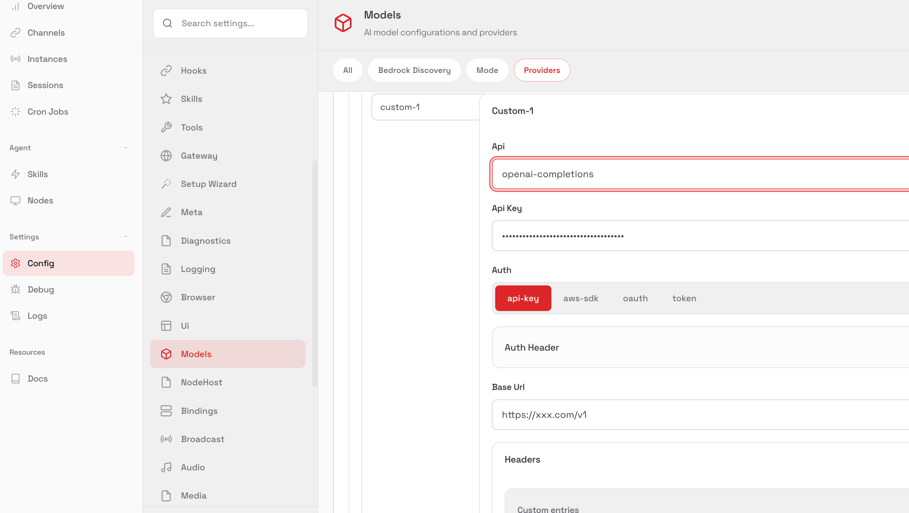
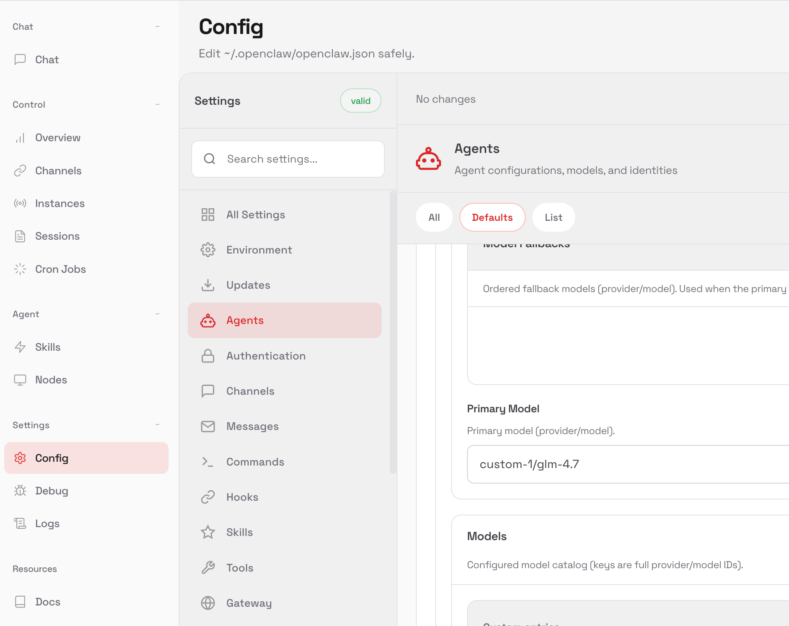

# Agent-Sandbox部署神器，为你公司每个同事部署一个OpenClaw（Clawdbot, Moltbot），快速体验OpenClaw（Clawdbot, Moltbot）的魅力

名字变迁：Clawdbot -> Moltbot -> OpoenClaw

用到的工具：https://github.com/agent-sandbox/agent-sandbox

## 效果：




## 一，用Agent-Sandbox 中创建一个 OpenClaw 沙箱

在 Agent-Sandbox 中，所有沙箱的创建都通过同一个 RESTful API：`POST /api/v1/sandbox`。

当你安装好 Agent-Sandbox，只需要一行 `curl` 就能在集群中拉起一个 OpenClaw 实例：

```shell
curl --location 'http://agent-sandbox.your-host.com/api/v1/sandbox' \
  --header 'Content-Type: application/json' \
  --data '{"name":"openclaw1","template":"openclaw"}'
```

```json
{
  "code": "0",
  "data": "Sandbox openclaw-alice created successfully"
}
```

这一步，就已经在你的 Kubernetes 集群里为某位同事拉起了一个完整可用的 OpenClaw 实例。

## 他的访问地址会是：

http://localhost:10000/sandbox/openclaw1

## 二、OpenClaw 配置
默认配置示例如下：
```json
{
  "models": {
    "providers": {
      "custom-1": {
        "baseUrl": "https://xxx.com/v1",
        "apiKey": "fe87c9e9-f399-49ca-98da-2f2404a249c2",
        "auth": "api-key",
        "api": "openai-completions",
        "models": []
      }
    }
  },
  "agents": {
    "defaults": {
      "model": {"primary": "custom-1/glm-4.7" },
      "workspace": "/root/.openclaw/workspace",
      "maxConcurrent": 4,
      "subagents": {
        "maxConcurrent": 8
      }
    }
  },
  "gateway": {
    "port": 18789,
    "mode": "local",
    "bind": "lan",
    "controlUi": {
      "allowInsecureAuth": true
    }
  }
}
```
模板中的 `openclaw.json` 给出了一个默认配置示例，包括：

- **模型配置**：示例中使用了名为 `custom-1/glm-4.7` 的模型，你可以根据公司内部模型网关进行调整。
- **网关参数**：
  - 端口：`18789`
  - 绑定模式：`lan`
  - 认证方式：密码登录（示例密码为 `1`）。

之后访问 http://localhost:10000/sandbox/openclaw1 即可进入 OpenClaw 界面，修改大模型参数，

### 1，修改大模型Provider


### 2，修改Agent默认大模型名称


根据需要调整模型和网关配置，即可开始使用 OpenClaw 了！

