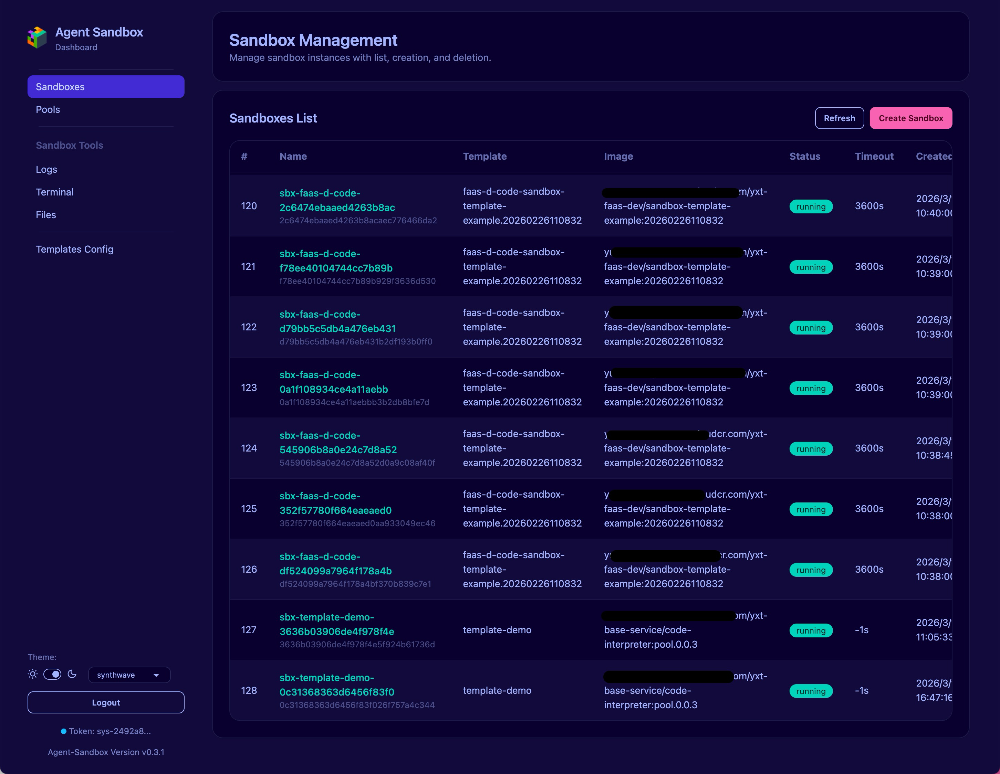

# Agent Sandbox UI

A React + TypeScript web console for managing Agent Sandbox resources.

It provides authenticated operations for sandbox lifecycle, pool management, logs, terminal access, files, and template configuration.

## Tech Stack

- **Framework**: React 19
- **Language**: TypeScript 5
- **Build Tool**: Vite 7
- **Routing**: React Router (Hash Router)

Key files:

- `src/main.tsx`: app bootstrap and theme initialization
- `src/router/index.tsx`: route table and auth guard
- `src/layouts/AppShellLayout.tsx`: global shell layout and theme/auth controls
- `src/lib/api/*`: API access layer
- `src/lib/auth/token.ts`: token persistence helpers
- `src/lib/theme/theme.ts`: theme persistence helpers

## Feature Highlights

### 1) Token-based login

- Login page at `/#/login`
- Token is stored in browser `localStorage`
- Protected routes redirect to login when token is missing
- Logout clears token and returns to login

### 2) Unified API authentication

- All standard API calls inject `X-Api-Key`
- File download requests also inject `X-Api-Key`
- Terminal WebSocket uses `api_key` query parameter (browser WS header limitation)

### 3) Sandbox operations

- List/Create/Delete sandboxes
- View sandbox logs
- Open interactive terminal session
- Browse/Upload/Delete/Download sandbox files

### 4) Pool and template management

- Pool list and pool detail view
- Templates config read/update


## Project Structure

```text
ui/
  src/
    layouts/
      AppShellLayout.tsx
    lib/
      api/
      auth/
      config/
      theme/
    pages/
      LoginPage.tsx
      SandboxesPage.tsx
      PoolListPage.tsx
      PoolDetailPage.tsx
      LogsPage.tsx
      TerminalPage.tsx
      FilesPage.tsx
      TemplatesConfigPage.tsx
    router/
      index.tsx
    styles/
      index.css
  package.json
  vite.config.ts
```

## Development

### Prerequisites

- Node.js 20+
- npm 10+
- Backend service available (default: `http://127.0.0.1:10000`)

### Install dependencies

```bash
npm install
```

### Start dev server

```bash
npm run dev
```

Vite dev server proxies backend calls via `vite.config.ts`:

- `/api/v1` -> `http://127.0.0.1:10000`
- `/healthz` -> `http://127.0.0.1:10000`

### Lint

```bash
npm run lint
```

### Build

```bash
npm run build
```

### Preview production build locally

```bash
npm run preview
```

## Configuration

### API base URL

Set `VITE_API_BASE_URL` when needed.

Default value in code:

- `/api/v1` (see `src/lib/config/api.ts`)

Example:

```bash
VITE_API_BASE_URL=/api/v1 npm run dev
```

## Deployment

### Static build artifacts

After `npm run build`, output is in:

- `ui/dist/`

This project uses hash routing, so static hosting is straightforward (no server-side route rewrite required for app paths like `/#/sandboxes`).

### Integrated backend serving

Backend serves static UI files from `/ui/` path. Typical flow:

1. Build UI with `npm run build`
2. Ensure `ui/dist` is packaged with backend runtime image or deployment artifact
3. Access app through backend endpoint

